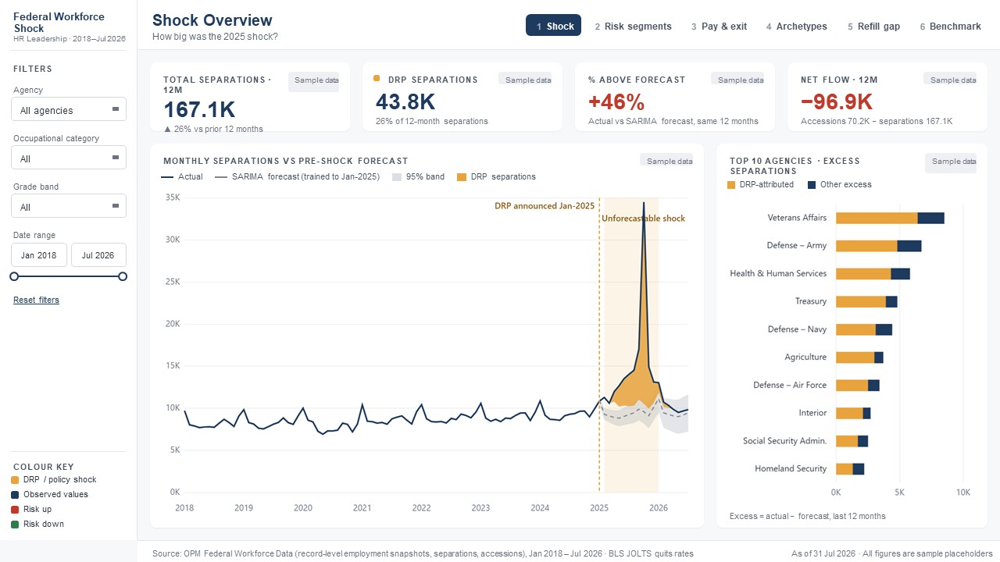
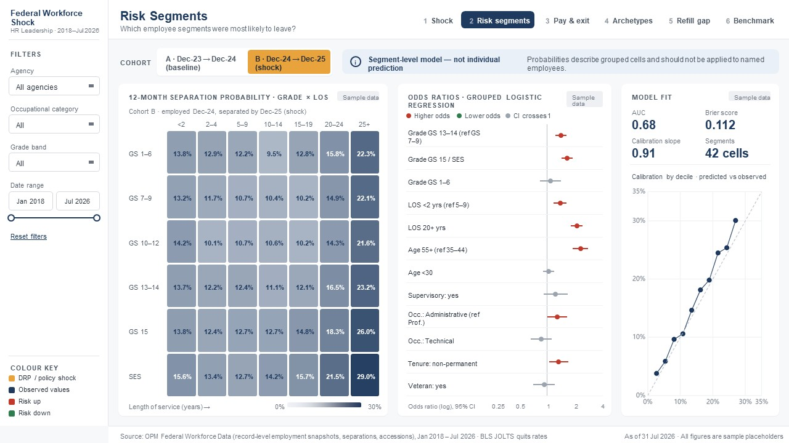
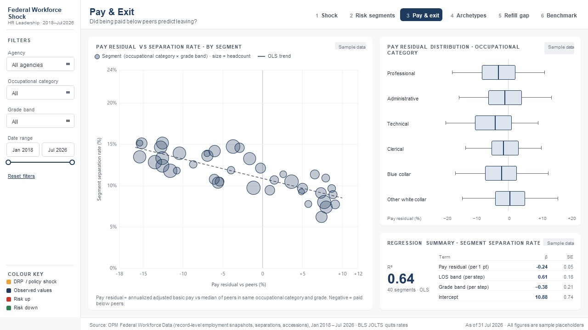
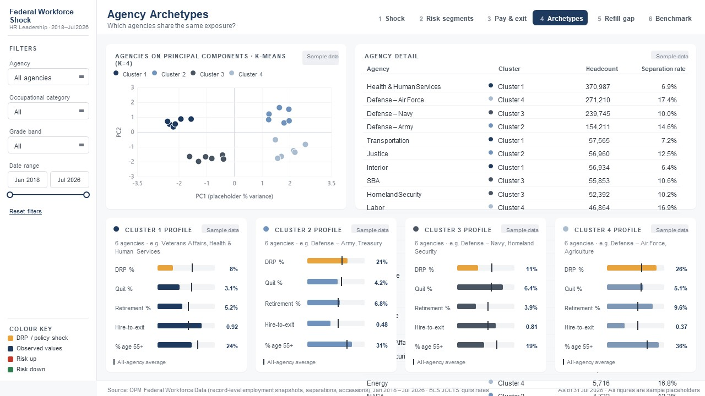
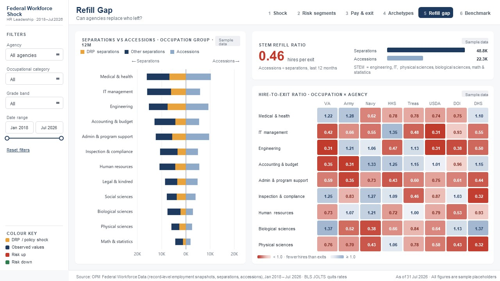
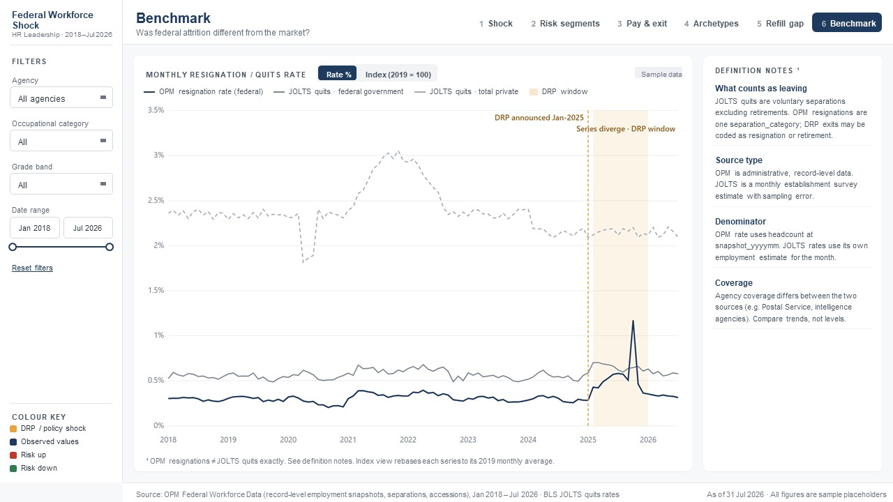

# Federal Workforce Shock

In 2025 the US federal civilian workforce was hit by a policy-driven shock: the Deferred Resignation Program (DRP). This project measures how large that shock was, identifies which employee segments left, tests whether pay played a role, and groups agencies by their exposure.

**Stack:** Python (DuckDB, pmdarima, statsmodels, scikit-learn) for data engineering and modelling, Power BI for the report.
**Data:** OPM record-level employment, separations and accessions files, Dec 2023 to Jul 2026 (32 monthly snapshots, ~2.3M employees).

> **Status: work in progress.** The data pipeline and all models are complete. The Power BI report is being built page by page against the design mockups below. See the [commit history](https://github.com/gbarakat/Federal-Workforce-Shock/commits/main) for day-to-day progress.



<sub>Design mockup. Figures on the mockups are placeholders, not results. Real results are under [Key findings](#key-findings).</sub>

<details>
<summary>All six page designs</summary>

| | |
|---|---|
|  |  |
|  |  |
|  |  |

</details>

## Key findings

From the current model outputs (`model_outputs/`, `export/`):

- **September 2025 was the shock month.** 133,614 separations against a counterfactual forecast of 19,543 (95% interval 12,903 to 26,183): about 114,000 excess exits in one month. 107,201 of them carried the DRP flag.
- **A second, smaller wave came in December 2025:** 45,964 separations (24,346 DRP), about 26,400 above forecast.
- **2025 in total:** 391,433 separations, of which 138,174 were DRP, against only 127,693 accessions. That is a net loss of 263,740 employees, or 0.33 hires per exit.
- **Long-tenured staff left at more than twice the rate of everyone else.** Among employees with 21+ years of service, 12.3% took the DRP in 2025, against 4.7% of all other staff. No other length-of-service band was above 5.8%.
- **Exposure was concentrated.** Of 49 agencies with 500+ staff, 34 were low-impact (average DRP exit rate 4.6%). Two were in *Mass Workforce Contraction* (26.5%) and eight in *Severe Brain Drain* (20.8%, skewed to senior staff). The highest rates were at GSA (31.6%), Corporation for National and Community Service (28.9%) and HUD (26.0%).
- **After the shock, attrition fell below baseline.** Separations were below the forecast in every month from February to July 2026. That pattern fits exits that were pulled forward rather than added.

Segment-risk and pay results are held back until a data-coverage issue is fixed. See [Limitations and known issues](#limitations-and-known-issues).

## Report pages

| # | Page | Question | Fed by | Status |
|---|------|----------|--------|--------|
| 1 | Shock Overview | How big was the 2025 shock? | `fct_forecast`, `fact_separations`, `fact_accessions` | Layout and KPI cards in progress |
| 2 | Risk Segments | Which employee segments were most likely to leave? | `fct_segment_risk` | Layout only |
| 3 | Pay & Exit | Did pay play a role? | `fct_pay_elasticity` | Layout only |
| 4 | Agency Archetypes | Which agencies share the same exposure? | `dim_agency_archetype` | Layout only |
| 5 | Refill Gap | Can agencies replace who left? | `fct_refill_gap` | Layout only |
| 6 | Benchmark | Was federal attrition different from the market? | BLS JOLTS quits (not yet ingested) | Not started |

## Repository structure

```
├── Fedral_workforce_shock_project.ipynb    Pipeline: ingestion → models → star-schema export
├── Federal Workforce Shock.pbix            Power BI report
├── drp_navy_amber_theme.json               Power BI theme (navy/amber, amber = DRP)
├── export/                                 Star schema for Power BI (dims + facts, Parquet)
├── model_outputs/                          Model results for Power BI (Parquet)
├── Federal_Workforce_Shock_Dashboard/      Page design mockups (images)
├── Federal_Workforce_Shock_Dashboard.pptx  Design mockup deck
├── scripts/daily-commit.ps1                Commit and push the day's work
└── requirements.txt
```

These are not in the repo and are rebuilt locally: `Data/` (57 GB of raw OPM text files), `parquet/` (~3 GB), and `opm.duckdb`.

## Method

**1. Data engineering (DuckDB).** The 32 monthly files per dataset are read as text and converted to Parquet, which shrinks ~57 GB to ~3 GB. Typed views (`v_emp`, `v_sep`, `v_acc`) add length-of-service bands (0–2, 3–5, 6–10, 11–20, 21+) and GS grade bands. Records before Dec 2023 are dropped as retroactive actions. Validation checks confirmed that one row is one person (`count` is always 1). They also checked how the DRP flag maps to separation categories and found a pay null rate of 0.003% for full-time GS staff.

**2. Counterfactual baseline.** `pmdarima.auto_arima` is fitted on Dec 2023 to Jan 2025, before the DRP was announced, and forecast forward with a 95% interval. Excess separations are actual minus forecast. This is run for all agencies combined and for each of the 10 largest agencies by Dec 2024 headcount.

**3. Segment risk.** A grouped binomial GLM (logit link) models 2025 DRP exits over Dec 2024 headcount by occupational category, grade band and length-of-service band. Only cells with at least 30 employees are used. Cells are split into Low, Medium and High risk tiers at the 33rd and 66th percentiles of predicted rate.

**4. Pay.** A weighted least-squares regression models DRP exit rate against log average salary, controlling for occupational category and grade band and weighted by headcount. Cells are agency × occupation × grade × $10K salary band.

**5. Agency archetypes.** K-Means (k = 4) is run on standardised agency metrics: DRP exit rate, senior share of DRP exits (11+ years or GS-12 and above), and supervisor exit rate. Clusters are labelled from their centroids.

**6. Refill gap.** Monthly accessions and separations are compared by agency × occupational category to give net flow and hire-to-exit ratio.

## Data model

Facts join to `dim_date` on `yyyymm` and to `dim_agency` on `agency_code`.

| Table | Grain |
|-------|-------|
| `fact_headcount` | month × agency × occupational category × grade band × LOS band × age bracket |
| `fact_separations` | as above × separation category × DRP flag |
| `fact_accessions` | as above × accession category |
| `dim_agency` | agency (133) |
| `dim_date` | month (32), with calendar and federal fiscal year |
| `fct_forecast` | month × agency (total + top 10), Feb 2025 onward |
| `fct_segment_risk` | occupational category × grade band × LOS band (139 cells) |
| `fct_pay_elasticity` | agency × occupational category × grade band × salary band (2,480 cells) |
| `dim_agency_archetype` | agency with 500+ staff (49) |
| `fct_refill_gap` | month × agency × occupational category |

## Reproducing

1. Download the monthly **employment**, **separations** and **accessions** `.txt` files from [OPM Federal Workforce Data](https://data.opm.gov/explore-data/data/data-downloads). Put them in `Data/employment/`, `Data/separations/` and `Data/accessions/`. Each employment file is ~1.8 GB.
2. Set up Python 3.12:
   ```bash
   python -m venv .venv
   ```
   ```bash
   .venv\Scripts\pip install -r requirements.txt
   ```
3. Run `Fedral_workforce_shock_project.ipynb` top to bottom. This builds `parquet/`, `opm.duckdb`, `export/` and `model_outputs/`. The first Parquet conversion takes a while.
4. Open `Federal Workforce Shock.pbix` in Power BI Desktop and refresh. If you cloned to a different folder, repoint the Parquet sources under *Transform data → Data source settings*.
5. To reuse the theme elsewhere, go to *View → Themes → Browse for themes* and pick `drp_navy_amber_theme.json`.

## Limitations and known issues

- **Occupational category is missing for most DRP exits.** 118,502 of the 138,174 DRP separations in 2025 (85.8%) have a blank `occupational_category_code`. The segment-risk and pay models join on that field, so today they cover only about 14% of DRP leavers. Their results are provisional until this is handled, for example with an "Unknown" category or a fallback to occupational group.
- **Pay is missing for 44% of 2025 DRP separations**, which narrows the pay model further.
- **Short pre-shock history.** The baseline is trained on only 14 months, which is too few for seasonal terms, so the counterfactual is essentially flat at ~19,500 a month. The notebook's markdown calls it SARIMA, but the code fits a non-seasonal ARIMA.
- **Segment-level, not individual.** Risk scores describe grouped cells and should not be applied to named employees.
- **Benchmark page** needs BLS JOLTS quits data, which is not yet in the pipeline.

## Day-to-day workflow

To commit everything and push it to GitHub, run the script below. The commit message is the day's log entry, so say what changed:

```bash
powershell -ExecutionPolicy Bypass -File scripts\daily-commit.ps1 "Built KPI cards on Shock Overview"
```

Leave off the message and the script will ask for one. It will refuse to commit any file over 95 MB (GitHub's limit is 100 MB).

*Tip:* `.pbix` is a binary file, so Git can store versions but cannot show what changed. For readable diffs of report and model changes, save the report as a Power BI Project (*File → Save as → Power BI project (.pbip)*).

## Data source

U.S. Office of Personnel Management, [Federal Workforce Data](https://data.opm.gov/): EHRI status and dynamics files (employment snapshots, separations, accessions). These are public-domain U.S. government data.
